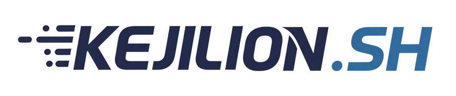
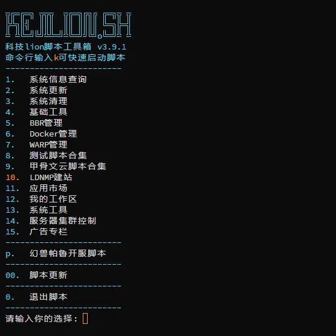
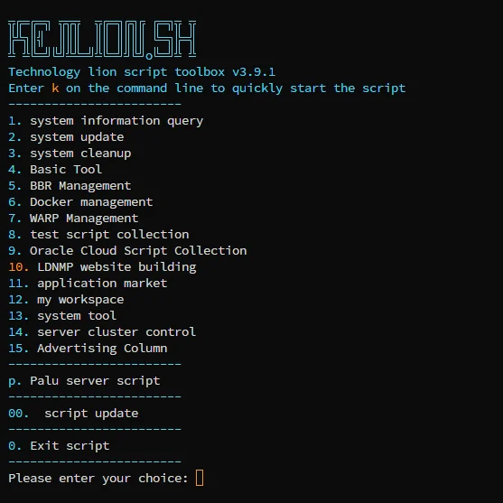

<br><br><br>
<div align="center">
  
</div>

<div align="center" style="margin-top:-200px;">
  <h1 style="font-size:150px;">KEJILION.SH - 科技lion一键脚本工具</h1>
</div>


<p align="center">
  <a href="/README.md">
    
  </a> 
  <a href="/README.tw.md">
    
  </a>
  <a href="/README.md">
    
  </a>
  <a href="/README.kr.md">
    
  </a>
  <a href="/README.ja.md">
    
  </a>
  <a href="/README.ru.md">
    
  </a>  
  <a href="/README.fa.md">
    
  </a>
</p>


<br><br><br>


## 📜 介绍 (Introduction)
科技Lion 的 Shell 脚本工具是一款全能脚本工具箱，专为 Linux 监控、测试和管理而设计。无论您是初学者还是经验丰富的用户，该工具都能为您提供便捷的解决方案。集成了独创的 Docker 管理功能，让您轻松管理容器化应用；LNMP建站解决方案能帮助您快速搭建网站，站点优化、防御、备份还原迁移一应俱全；并且整合了各类系统工具面板的安装及使用，使系统维护变得更加简单。我们的目标是成为全网最优秀的 Linux 一键脚本工具，为用户提供高效、便捷的科技支持。

KejiLion's Shell script tool is an all-in-one script toolbox designed for Linux monitoring, testing, and management. Whether you are a beginner or an experienced user, this tool offers convenient solutions. It integrates unique Docker management features, enabling easy containerized application management. The LNMP site-building solution helps you quickly set up websites, covering optimization, defense, backup, restoration, and migration. It also includes the installation and use of various system tool panels, making system maintenance simpler. Our goal is to become the best Linux one-click script tool on the internet, providing users with efficient and convenient tech support.

<br><br>


## 🌐 支持系统 (Supported Systems)

<p align="left">
  <a href="#">
    
  </a>
  <a href="#">
    
  </a>
  <a href="#">
    
  </a>
  <a href="#">
    
  </a>
  <a href="#">
    
  </a>
  <a href="#">
    
  </a>
  <a href="#">
    
  </a>
  <a href="#">
    
  </a>
  <a href="#">
    
  </a>
  <a href="#">
    
  </a>
</p>


<br><br>

## 🚀 一键安装 (One-Click Installation) CN
```bash
bash <(curl -fsSL https://raw.githubusercontent.com/cenet999/sh/main/kejilion.sh)
```

## 🚀 一键安装 (One-Click Installation) EN
```bash
bash <(curl -fsSL https://raw.githubusercontent.com/cenet999/sh/main/en/kejilion.sh)
```

<br><br>

## ⚡ 快速上手 (Quick Start)

- **建议使用 root 运行**：适合常见 Linux 服务器环境，很多功能会用到 Docker、系统服务和防火墙权限  
  *Recommended to run as root: many features need Docker, system service and firewall access*<br>

- **安装后输入 `k` 可再次打开主菜单**：主菜单里可以直接进入系统工具、Docker 管理、应用市场、建站和游戏开服  
  *After install, type `k` to reopen the main menu for system tools, Docker, app store, websites and game servers*<br>

- **应用市场已支持 `v2rayA`**：安装时会自动下载仓库里的 `v2raya-docker-compose.yml` 模板，默认网页入口端口是 `8115`  
  *`v2rayA` is available in the app store and uses the bundled `v2raya-docker-compose.yml` template with default web port `8115`*<br>

- **LNMP 上传网站教程**：新手可直接看 [`docs/lnmp-upload-website.md`](docs/lnmp-upload-website.md)  
  *Beginner guide for uploading a website after LNMP installation*<br>

<br><br>

## 🧩 附带脚本和配置 (Included Scripts & Templates)

- **`v2raya-docker-compose.yml`**：给应用市场里的 `v2rayA` 准备的 Docker Compose 模板，脚本会自动替换端口后再启动  
  *Docker Compose template used by the built-in `v2rayA` app installer*<br>

- **`mc.sh` / `palworld.sh`**：单独的游戏开服脚本，分别用来管理 Minecraft 和幻兽帕鲁服务器  
  *Standalone game server helpers for Minecraft and Palworld*<br>

- **[`docs/lnmp-upload-website.md`](docs/lnmp-upload-website.md)**：LNMP 安装后上传静态站、PHP 站、数据库导入和权限修复的新手教程  
  *Beginner guide for uploading static/PHP sites, importing databases, and fixing permissions after LNMP install*<br>

- **`tests/openclaw/README.md`**：OpenClaw 相关功能的最小冒烟测试说明  
  *Smoke-test guide for OpenClaw related features*<br>

- **`apps/README.md`**：开发者应用入驻说明，方便把应用接入脚本的应用市场  
  *Developer guide for submitting apps into the built-in app store*<br>

<br><br>

## 🖼️ 效果图预览 (Preview)
<p>
  
  
</p>


<br><br>
## 📦 核心功能 (Core Features)

- **系统信息概览**：快速展示 CPU、内存、磁盘、带宽等运行状态  
  *System status overview: CPU, memory, disk, bandwidth and more*<br>

- **网络测试工具**：集成测速、回程、延迟、丢包检测等  
  *Network tools: speed test, route trace, latency, packet loss test*<br>

- **Docker 容器管理**：独家容器可视化 + 容器控制增强命令  
  *Advanced Docker management with enhanced commands and visualization*<br>

- **LNMP 一键部署**：轻松搭建 Nginx + MySQL + PHP 站点  
  *One-click LNMP stack deployment (Nginx, MySQL, PHP)*<br>

- **网站防御与优化**：防CC、防爬虫，自动配置防火墙与性能优化  
  *Site defense and optimization: anti-CC, anti-crawler, firewall and tuning*<br>

- **备份与迁移**：站点与数据库一键备份/恢复/远程迁移  
  *Backup & migration: one-click site/database backup and remote restore*<br>

- **BBR 加速优化**：内核加速、网络拥塞控制智能切换  
  *Network acceleration: BBR/tcp congestion control optimization*<br>

- **应用市场集成**：内置主流工具与面板，支持一键安装常用服务  
  *App Store integration: built-in panels and tools for one-click deployment*<br>

- **代理面板支持**：应用市场已内置 `v2rayA`，可用网页方式管理代理节点与系统代理  
  *Proxy panel support: built-in `v2rayA` for web-based proxy management*<br>

- **OpenClaw 工具集成**：支持 OpenClaw 的 API、插件、技能和记忆相关管理  
  *OpenClaw integration: manage APIs, plugins, skills and memory related settings*<br>

- **游戏开服脚本**：内置 Minecraft、幻兽帕鲁等游戏服务器管理脚本  
  *Game server helpers for Minecraft, Palworld and more*<br>

- **自动更新机制**：定时检测脚本版本，保持最新最稳定  
  *Auto-update engine: ensure you're always running the latest version*<br>


<br><br>

## 💖 支持我们 (Support Us)
觉得脚本还可以 USTD TRC20 打赏

Feel free to support us with USTD TRC20 donations.

<strong style="color: navy;">TCP3PLGUTG9Z4z4tnHHSLbw5bgp8NXhTT3</strong>

<br><br>

## ⭐ Star History
[](https://star-history.com/#cenet999/sh&Date)
